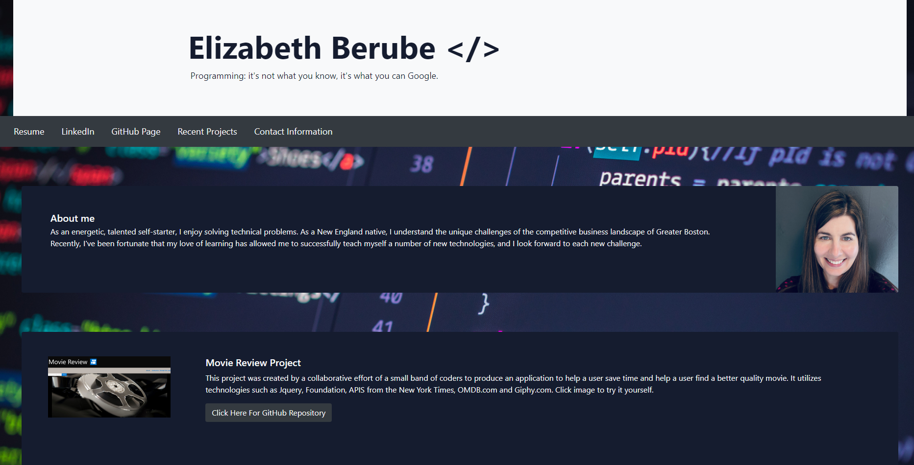
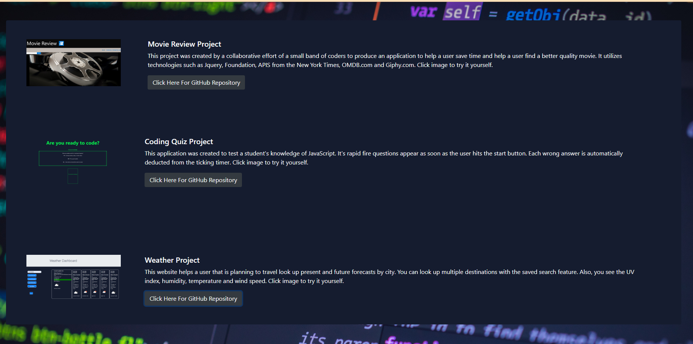

# Updated-Profile-Page

This updated portfolio page has been updated with more features, better styling, and up-to-date projects.

Here are some of the features of this page:

1. This page has updated contact information. Both email and phone number.

2. Includes links to GitHub profile and LinkedIn profile. 

3. There is contact information.

4. It has Project 1 and 2 homework projects with the titles, links to deployed versions, Links to GitHub repositories, and screenshots of deployed applications. 

5. The design is mobile-responsive, with a font large enough to read, colors that do not cause eye strain, and is not just a default bootstrap theme.

Link to page:  https://elizabethdberube.github.io/Updated-Profile/

